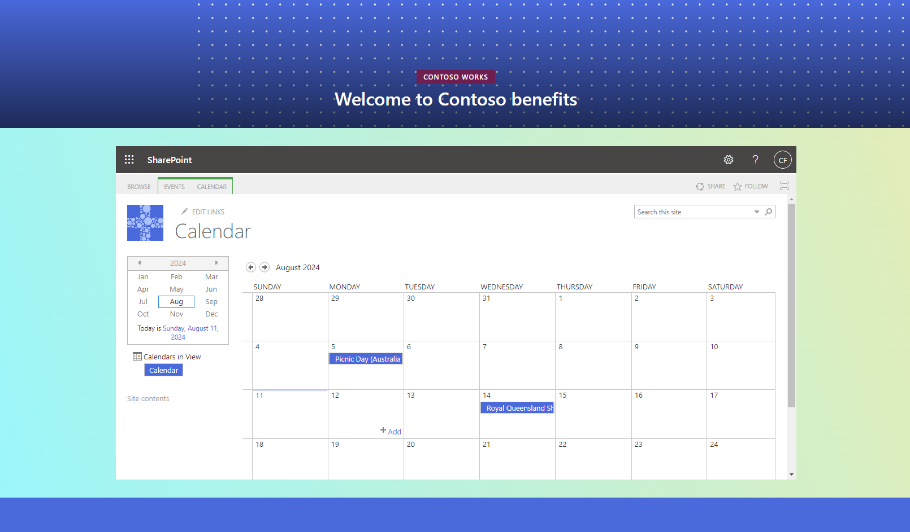

# SharePoint Site Provisioning with PowerShell

## Project Overview
This project uses PowerShell scripting to automate site provisioning and application of customised templates to SharePoint sites.

## Screenshot


## Tech Stack
- PowerShell 7.4.4
- Microsoft SharePoint
- PnP.PowerShell module

## PowerShell Scripting

### Creating New Sites

```powershell
function New-Sites {
    param (
        [int]$siteCount,
        [string]$sitePrefix,
        [string]$templatePath
    )
    
    Write-Host "Starting site creation process with $siteCount sites..."
    for ($i = 1; $i -le $siteCount; $i++) {
        $siteNumber = "{0:D4}" -f $i
        $siteUrl = "$SHAREPOINT_SITE_URL/sites/$sitePrefix$siteNumber"
        $siteTitle = "$sitePrefix $siteNumber"
        $siteDescription = "Site $sitePrefix number $siteNumber"
        
        Write-Host "DEBUG: Creating site with the following details:"
        Write-Host "siteUrl: $siteUrl"
        Write-Host "siteTitle: $siteTitle"
        Write-Host "siteDescription: $siteDescription"

        if ($siteUrl -and $siteUrl -ne "") {
            try {
                Write-Host "Creating site: $siteUrl"
                New-PnPSite -Type CommunicationSite -Url $siteUrl -Owner $OWNER_EMAIL -Title $siteTitle -Description $siteDescription
                Write-Host "Created site: $siteUrl"
                
                Write-Host "Waiting for 45 seconds before applying the template..."
                Start-Sleep -Seconds 45
                
                $modifiedTemplatePath = Convert-DateTimeFormatInTemplate -templatePath $templatePath
                Write-Host "Using modified template path: $modifiedTemplatePath"
                
                Invoke-Template -siteUrl $siteUrl -templatePath $modifiedTemplatePath
            } catch {
                Write-Error "Error creating site ${siteTitle}: $_"
            }
        } else {
            Write-Error "The site URL is empty or not properly set: $siteUrl"
        }
    }
}
```

### Applying the Template

```powershell
function Invoke-Template {
    param (
        [string]$siteUrl,
        [string]$templatePath
    )
    
    try {
        Write-Host "Connecting to site: $siteUrl"
        Connect-PnPOnline -Url $siteUrl -Credentials $cred
        Write-Host "Applying template to site: $siteUrl"
        Invoke-PnPSiteTemplate -Path $templatePath
        Write-Host "Template applied to site: $siteUrl"
    } catch {
        Write-Error "Error applying template to site ${siteUrl}: $_"
    }
}
```
### Converting DateTime

```powershell
function Convert-DateTimeFormatInTemplate {
    param (
        [string]$templatePath
    )

    [xml]$xmlContent = Get-Content -Path $templatePath

    $dateTimePattern = '(\d{1,2})/(\d{1,2})/(\d{4})\s(\d{1,2}):(\d{2})\s([APMapm]{2})'

    $xmlContent.SelectNodes("//*[text()]") | ForEach-Object {
        if ($_.InnerText -match $dateTimePattern) {
            $dateTimeString = $_.InnerText
            try {
                $parsedDateTime = [datetime]::ParseExact($dateTimeString, 'M/d/yyyy h:mm tt', $null)
                $_.InnerText = $parsedDateTime.ToString("yyyy-MM-ddTHH:mm:ssZ")
            } catch {
                Write-Error "Error parsing DateTime: $dateTimeString"
            }
        }
    }

    $modifiedTemplatePath = [System.IO.Path]::ChangeExtension($templatePath, "modified.xml")
    $xmlContent.Save($modifiedTemplatePath)

    return $modifiedTemplatePath
}
```

### Dynamic Event Addition

```powershell
function Add-CalendarEvents {
    param (
        [string]$siteUrl,
        [string]$eventsFilePath
    )
    
    Write-Host "Adding calendar events to site: $siteUrl"
    
    $events = Import-Csv -Path $eventsFilePath
    
    foreach ($event in $events) {
        $eventTitle = $event.Title
        $startTime = [datetime]::ParseExact($event.'Start Time', 'M/d/yyyy H:mm', $null)
        $endTime = [datetime]::ParseExact($event.'End Time', 'M/d/yyyy H:mm', $null)
        $recurrence = [bool]$event.Recurrence
        
        try {
            Add-PnPListItem -List "Calendar" -Values @{
                "Title" = $eventTitle
                "EventDate" = $startTime
                "EndDate" = $endTime
                "fAllDayEvent" = $true
                "fRecurrence" = $recurrence
            }
            Write-Host "Added event: $eventTitle"
        } catch {
            Write-Error "Error adding event ${eventTitle}: $_"
        }
    }
}
```

## Important Links

### Integrated Template Site
https://cyberforge000.sharepoint.com/sites/SiteFifteen0001

### Base Template Repository Site

- The base template for this site was sourced from the repository below:

https://github.com/SharePoint/sp-dev-provisioning-templates

## Assignment Questions

### Application of Azure Services

6) Azure Automation and Functions can be used to run PowerShell scripts for creating SharePoint sites in the cloud. For integration with this project Automation can manage the execution of the `Main.ps1` script and the functions contained within can handle HTTP triggers to run the automatic creation of sites. Services like Azure Key Vault can also be used to bridge services like these to allow shared access and also secure storage for sensitive project information.

### General Application

7) The three services - Azure Automation, Functions and Key Vault - work cohesively together to provide automation processes with a trigger, that can be used for many applications. A focus on outsourcing demanding compute tasks to virtual machines in the cloud is incredibly powerful and useful, particularly for tasks that benefit from scaling of resources. Also the serverless nature of Azure Functions allows for cost efficient solutions with having to manage infrastrucutre directly. 


## Learning Highlights
- Gaining experience scripting with PowerShell
- Automating SharePoint site creation
- Developing skills with a Microsoft Stack


## Challenges
- Dynamic population of data into the customised template
- Scripting to export the automatically created site


## Contact Me
- Visit my [LinkedIn](https://www.linkedin.com/in/obj809/) for more details.
- Check out my [GitHub](https://github.com/cyberforge1) for more projects.
- Or send me an email at obj809@gmail.com
<br />
Thanks for your interest in this project. Feel free to reach out with any thoughts or questions.
<br />
<br />
Oliver Jenkins © 2024